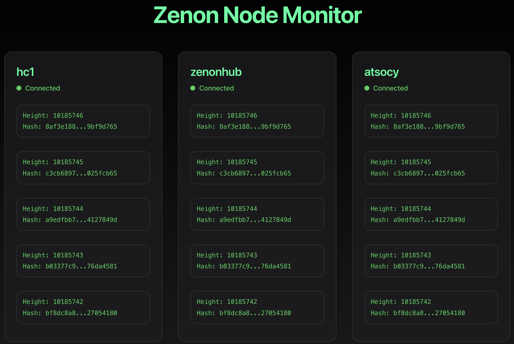

# Zenon Node Monitor

A real-time monitoring dashboard for tracking and comparing Zenon network public nodes. This application helps identify consensus and synchronization issues across multiple nodes by visualizing their momentum heights and hashes.



## Features

- Real-time monitoring of multiple Zenon public nodes
- Visual comparison of momentum heights and hashes
- Automatic detection of consensus matches and mismatches
- Connection status monitoring
- Stale momentum detection
- Modern, macOS-style dark mode interface

## Prerequisites

- Node.js (v16 or higher)
- Python 3.8+
- Running Zenon nodes with RPC access

## Project Structure

```
zenon-node-monitor/
├── frontend/           # React frontend application
│   ├── src/           # Source files
│   ├── public/        # Static files
│   └── package.json   # Frontend dependencies
├── monitor.py         # Python backend server
├── config.py          # Node configuration
└── requirements.txt   # Python dependencies
```

## Setup

### Backend

1. Create and activate a Python virtual environment:
```bash
python -m venv venv
source venv/bin/activate  # On Unix/macOS
# or
.\venv\Scripts\activate  # On Windows
```

2. Install the required Python packages:
```bash
pip install -r requirements.txt
```

3. Configure your nodes in `config.py`.

### Frontend

1. Install the Node.js dependencies:
```bash
cd frontend
npm install
```

## Running the Application

1. Start the backend server:
```bash
python monitor.py
```
The API server will start on `http://localhost:8000`

2. In a new terminal, start the frontend development server:
```bash
cd frontend
npm start
```
The application will open in your default browser at `http://localhost:3000`

## Development

### Backend API Endpoints

- `GET /api/nodes` - Returns the current state of all monitored nodes
- `GET /api/nodes/{node_name}` - Returns the state of a specific node

### Frontend Components

- `App.js` - Main application component
- `NodeCard.js` - Individual node display component
- `MomentumCard.js` - Momentum information display

## Contributing

1. Fork the repository
2. Create a feature branch
3. Commit your changes
4. Push to the branch
5. Create a Pull Request

## License

This project is licensed under the MIT License - see the [LICENSE](LICENSE) file for details. 